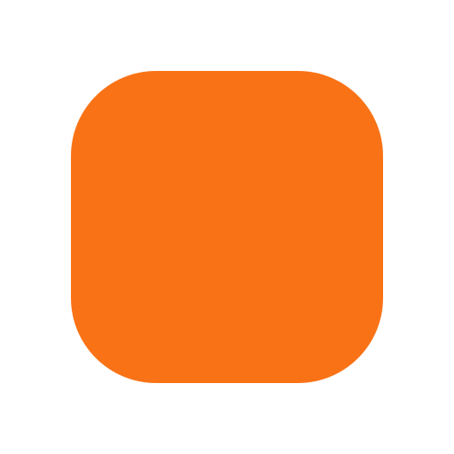
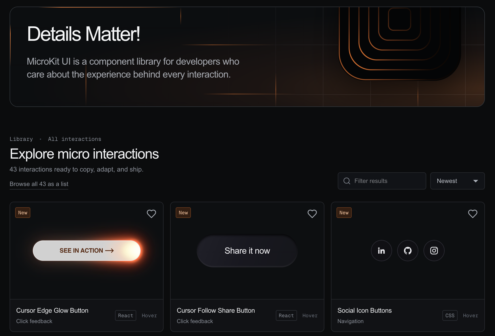

<div align="center">
  <br />
  
  <h1>MicroKit UI</h1>
  <strong>Details matter.</strong>
  <br />
  <sub>Copy-paste microinteractions for thoughtful product interfaces.</sub>
  <br />
  <br />
  <a href="https://github.com/henriquegpb/microkit/stargazers">
    
  </a>
  <a href="https://www.microkit.co">
    
  </a>
  <a href="https://ui.shadcn.com/docs/registry/registry-index">
    
  </a>
  <br />
  <br />
  <code>npx shadcn@latest add @microkit/cursor-edge-glow-button</code>
  <br />
  <br />
  <a href="https://www.microkit.co">Explore interactions</a>
  ·
  <a href="https://www.microkit.co/submit">Submit a component</a>
  ·
  <a href="https://www.microkit.co/sponsors">Sponsors</a>
  <br />
  <br />
  <a href="https://www.microkit.co">
    
  </a>
</div>

<br />

## Why MicroKit?

MicroKit is a focused library for the small interactions that make an interface feel considered. Each component has a live preview and copy-ready source, so you can inspect the behavior, choose your preferred implementation, and adapt it directly in your project.

MicroKit is built for copying and learning from the source—not for hiding interaction details behind a package API.

## Features

- **47 interactive components** with dedicated preview pages
- **One-command install** through the shadcn CLI, or copy the source by hand
- **JavaScript and TypeScript** implementations
- **CSS and Tailwind** styling variants
- **Live previews** for testing every interaction before copying
- **Copy-ready source** designed to reproduce the displayed component
- **Favorites and recently viewed** components stored locally in the browser
- **Direct component routes** for sharing individual interactions
- **GitHub-based submissions** with no custom backend required

## Install with the shadcn CLI

MicroKit is published as a [shadcn registry](https://ui.shadcn.com/docs/registry)
and listed in the
[open source registry directory](https://ui.shadcn.com/docs/registry/registry-index),
so the `@microkit` namespace resolves without any configuration:

```bash
npx shadcn@latest add @microkit/cursor-edge-glow-button
```

The CLI writes the component to `components/microkit/` as a single
self-contained TypeScript and Tailwind file — the same source the site shows —
and installs anything it imports. From there the code is yours to edit.

Browse what is available:

```bash
npx shadcn@latest search @microkit
```

There is still no npm package, and there is not going to be one. The CLI copies
a file and exits; nothing is added to your dependency tree but what the
component itself imports.

<details>
<summary>Without the namespace</summary>

Every item is also addressable by URL, which needs no registry index at all:

```bash
npx shadcn@latest add https://microkit.co/r/cursor-edge-glow-button.json
```

And straight from this repository:

```bash
npx shadcn@latest add henriquegpb/microkit/cursor-edge-glow-button
```

</details>

## Copying by hand

The CLI ships the TypeScript + Tailwind variant. The site carries four, so copy
from there if you want JavaScript, or plain CSS instead of utility classes:

1. Open the [interaction library](https://www.microkit.co).
2. Select a component to open its dedicated page.
3. Test the interaction in the live preview.
4. Open the **Code** tab.
5. Choose JavaScript or TypeScript.
6. Choose CSS or Tailwind.
7. Copy the source into your project and customize it.

Some interactions use `lucide-react` for icons. Any required dependency is
visible in the copied source, and the CLI installs it for you.

## Run locally

**Requirements:** Node.js 20 or newer and npm.

```bash
git clone https://github.com/henriquegpb/microkit.git
cd microkit
npm install
npm run dev
```

Open [http://localhost:3000](http://localhost:3000).

Create a production build with:

```bash
npm run build
```

## Project structure

```text
app/
  components/[id]/page.tsx   Dedicated component routes
  sponsors/page.tsx          Sponsors route
  submit/page.tsx            Contribution route
  page.tsx                   Gallery, previews, and shared page UI
  globals.css                Visual system and interaction styles

content/
  interactions/catalog.ts    Component metadata and copyable source

registry.json                shadcn registry catalog (generated)
registry/microkit/           One distributable file per interaction (generated)
scripts/build-registry.mjs   Generates both from the catalog

public/
  r/                         Published registry JSON (generated)
  assets/img/                Shared logos and visual assets

.github/
  ISSUE_TEMPLATE/            Component submission form
```

## Sponsors

MicroKit is supported by:

### Diamond

<table>
  <tr>
    <td align="center">
      <br />
      
      <br />
      <sub>Your AI Personal Assistant</sub>
      <br />
      <br />
    </td>
  </tr>
</table>

Support helps keep MicroKit available and gives the project more room to improve its components, documentation, and contribution workflow.

**[Become a MicroKit sponsor](https://www.microkit.co/sponsors)** — Choose a tier and send a prefilled sponsorship inquiry.

## Contributing

You can submit an interaction through the [MicroKit submission page](https://www.microkit.co/submit). The page prepares a GitHub issue containing your component code, where you can add a screenshot and any necessary attribution.

Before submitting:

- Keep the interaction focused on one clear behavior.
- Make the preview genuinely interactive.
- Include the complete code required to reproduce the result.
- Support keyboard focus where the element is interactive.
- Respect reduced-motion preferences when motion is not essential.
- Avoid unnecessary dependencies.
- Credit the original source when adapting someone else’s work.

You can also use the [component submission issue form](https://github.com/henriquegpb/microkit/issues/new?template=component-submission.yml) directly.

## Development

Useful commands:

```bash
npm run dev
npm run lint
npm run build
npm run start
npm run registry:build
```

`registry:build` regenerates the shadcn registry from the catalog. Run it after
changing an interaction's `source.ts` and commit the regenerated `registry.json`,
`registry/microkit/*.tsx` and `public/r/*.json` in the same change — they are
build artifacts, and hand-editing them is how the installed code drifts from the
code the site shows.

The site is built with Next.js, React, TypeScript, Tailwind CSS, Lucide icons, Prism syntax highlighting, and Vercel Analytics.

## Maintainer

MicroKit is maintained by [@henriquegpb](https://github.com/henriquegpb).

## Credits

Some interactions are adapted from publicly shared examples and Webflow exports. MicroKit rewrites them into reusable JavaScript, TypeScript, CSS, and Tailwind implementations. If you recognize work that needs clearer attribution, please [open an issue](https://github.com/henriquegpb/microkit/issues).
